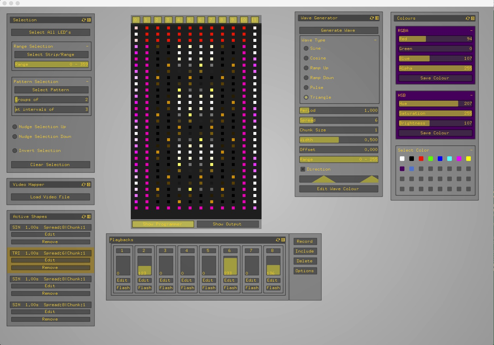

# pixel-strip-animation-programmer
OpenFrameworks application and Arduino code for programming cues and animations on LED pixel strip

Built on concepts from lighting console software, this OpenFrameworks application enables
the programming, storage and playback of cues an animations on LED pixel strip.
It sends data over serial to Arduino which updates the strips with SPI.
Very much a work in progress and far from show-ready.

  

